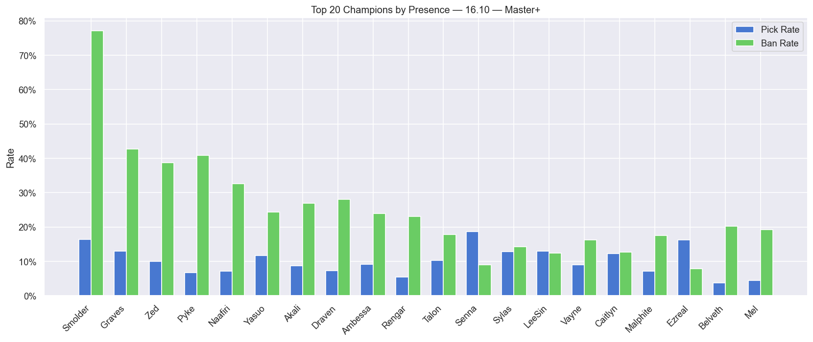
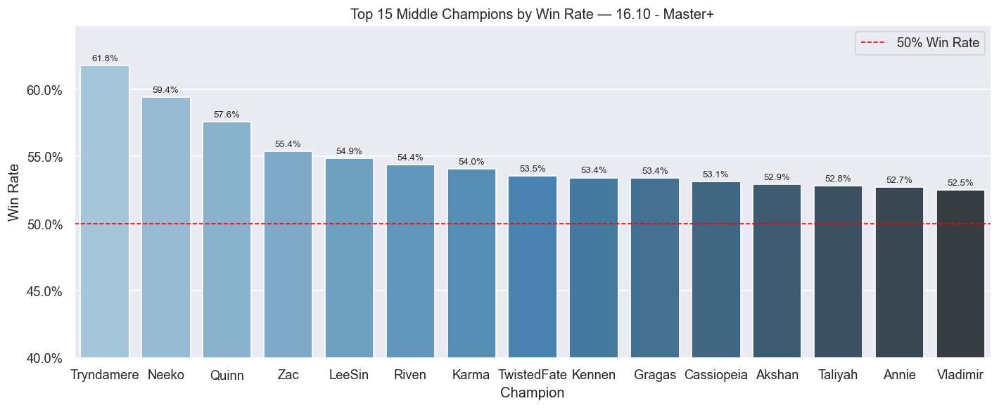
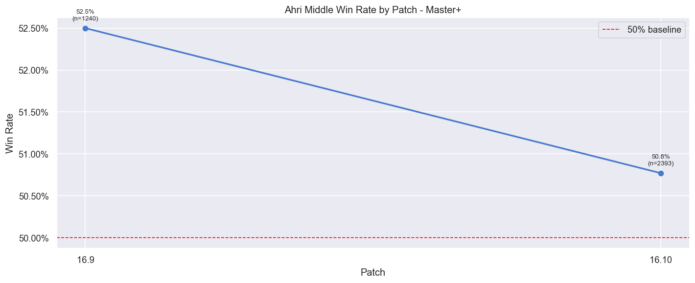
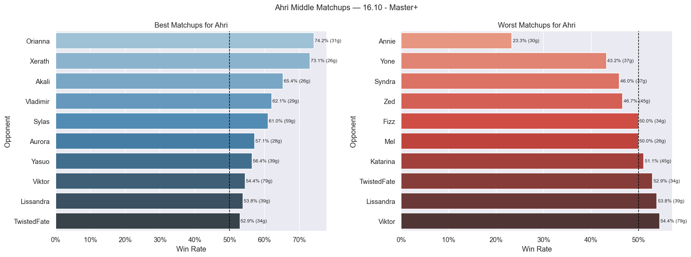
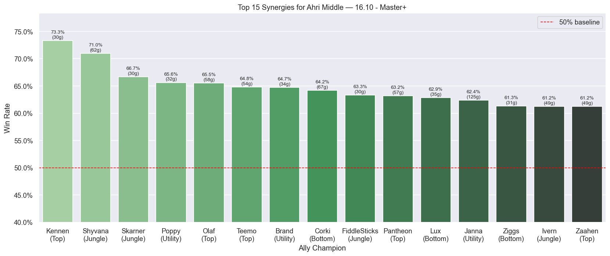

# LOL Meta Analysis
A full data collection and analysis pipeline built in python, collecting League of Legends match data in order to provide champion-level insights. Analysis and visualizations provided using Jupyter Notebooks.

---
## Project Structure
```
analysis/
    champions.py # Analysis functions for champion-level insights
api/
    endpoints.py # Collection functions to reach the Riot API
    riot_client.py # Client to handle requests to Riot servers and rate-limiting
data/
    cleaner.py # Cleans raw JSON blobs from raw database into clean relational tables
    collector.py # Collects raw JSON blobs from the Riot API
    database.py # Functions to create and insert into SQLite tables
    derive.py # Derives analysis-ready tables from cleaned database
images/ # Screenshots for README
notebooks/
    champion_analysis.ipynb # Champion-level analysis and visualizations
sql/
    clean/
        create_matches.sql # Creates clean matches tables
        create_participants.sql # Creates clean participants tables
        create_perks.sql # Creates clean perks tables
        create_teams.sql # Creates clean teams tables
    derived/
        create_champion_presence.sql # Creates champion presence table for analysis
        create_champion_stats.sql # Creates champion stats table for analysis
        create_matchups.sql # Creates champion matchups table for analysis
        create_synergies.sql # Creates champion synergies table for analysis
    raw/
        create_raw.sql # Creates matches table to store raw JSON blobs
.env.example # RIOT_API_KEY goes here
config.py # Configuration for data collection, cleaning, and derivation
main.py # Runs full data collection, cleaning, and derivation pipeline
utils.py # Utility functions
requirements.txt # Holds dependencies for easy install
```

---
## Database Architecture

The pipeline uses three SQLite databases, each representing a stage in the data pipeline:

**`raw.db`** stores exact Riot API response as JSON blobs. This is never modified after collection, acting as a source of truth and saving on future API calls if more data needs to be collected. 

**`clean.db`** contains normalized relational tables parsed from the raw JSON in `raw.db`:
- `matches` - match-level info (duration, patch, tier, result)
- `participants` - player-level stats (KDA, damage, CS, vision, items)
- `teams`, `team_objectives`, `team_bans` - team-level data
- `perk_stats`, `perk_styles`, `perk_selections` - rune selections

**`derived.db`** contains analysis-ready aggregations computed from the clean layer:
- `champion_stats` - win rates and average stats per champion, lane, patch, and tier
- `champion_presence` - pick, ban, and presence rates per champion, patch, tier
- `lane_matchups` - raw head-to-head matchup events per lane per match
- `matchup_stats` - aggregated matchup win rates per champion pair
- `champion_synergies` - win rates for champion pairs on the same team

---
## Setup

**1. Clone the repository**
```bash
git clone https://github.com/your-username/lol-meta-analysis.git
cd lol-meta-analysis
```

**2. Create and activate a virtual environment**
```bash
python -m venv .venv
# MacOS/Linux:
source .venv/bin/activate
# Windows
.venv\Scripts\activate
```

**3. Install dependencies**
```bash
pip install -r requirements.txt
```

**4. Get a Riot API key**
- Sign up/Login at the [Riot Developer Portal](https://developer.riotgames.com/)
- Generate an API key under "Development API Key"
- Note: Developer API keys expire every 24 hours and must be regenerated

**5. Add your API key**
- Copy `.env.example` to `.env`
- Replace the placeholder with your key

**6. Configure the pipeline**
- Edit `config.py` to set which tiers to collect, how many players and matches per player, minimum patch, and database paths
- By default the pipeline collects Challenger, Grandmaster, and Master from NA
- `COLLECT_MIN_PATCH` must be updated, patches become stale as Riot stores only the latest 100 matches per player

---
## Usage

Run the pipeline.
```bash
python main.py
```

This runs all three stages in order - collect, clean, and derive. Each stage is independent and safe to re-run at any time.

Open the notebook to explore the analysis and visualizations.
```bash
cd notebooks
jupyter notebook champion_analysis.ipynb
```

---
## Analysis
The notebook covers 5 sections of champion-level analysis
Each section provides a table and graph view of the relevant statistics

- **Champion presence** - pick rate per lane, ban rate, and presence rate across all champions

- **Best Champions by Lane** - champions ranked by win rate for a given lane

- **Patch Trends** - win rate evolution across patches for a specific champion in a lane

- **Matchups** - best and worst lane matchups for a champion in a lane

- **Synergies** - best champion synergies for a champion in a lane


The configuration cell at the top of the notebook controls all filters.
```python
TIER = MASTER_PLUS # "CHALLENGER", MASTER_PLUS, or None for all.
VERSION = "16.10" # "16.10" 
MIN_GAMES = 50 # minimum games for a champion to appear in analysis
MIN_MATCHUP_GAMES = 25 # minimum games for a matchup/synergy to appear
```

Below each section header there are configuration variables for Champion and Lane selections.
```python
TREND_CHAMPION = "Ahri" # Change to any champion e.g. "Ahri"
TREND_LANE = "MIDDLE" # Change to TOP, JUNGLE, MIDDLE, BOTTOM, UTILITY
```

---
## Notes

**Sample Size** - with a development API key data collection throughput is a limitation. Keep in mind to update `MIN_GAMES` in the notebook configuration in order to view more reliable results. 

**Security** - DO NOT give out your Riot API key or your `.env` file. 

**Riot Games disclaimer** - LOL Meta Analysis was created under Riot Games' "Legal Jibber Jabber" policy using assets owned by Riot Games.  Riot Games does not endorse or sponsor this project.